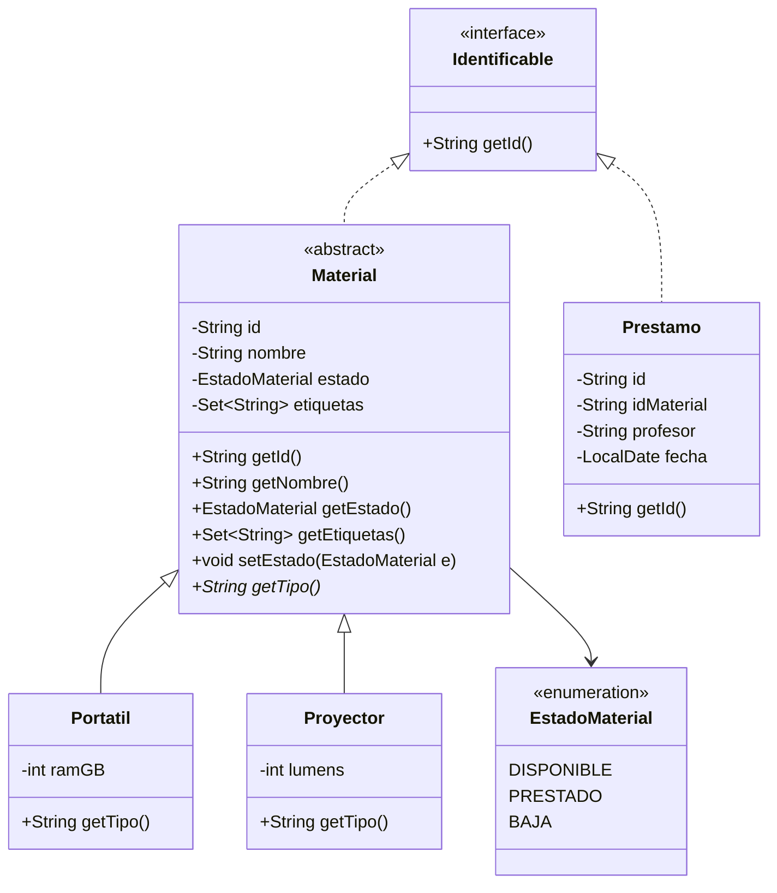
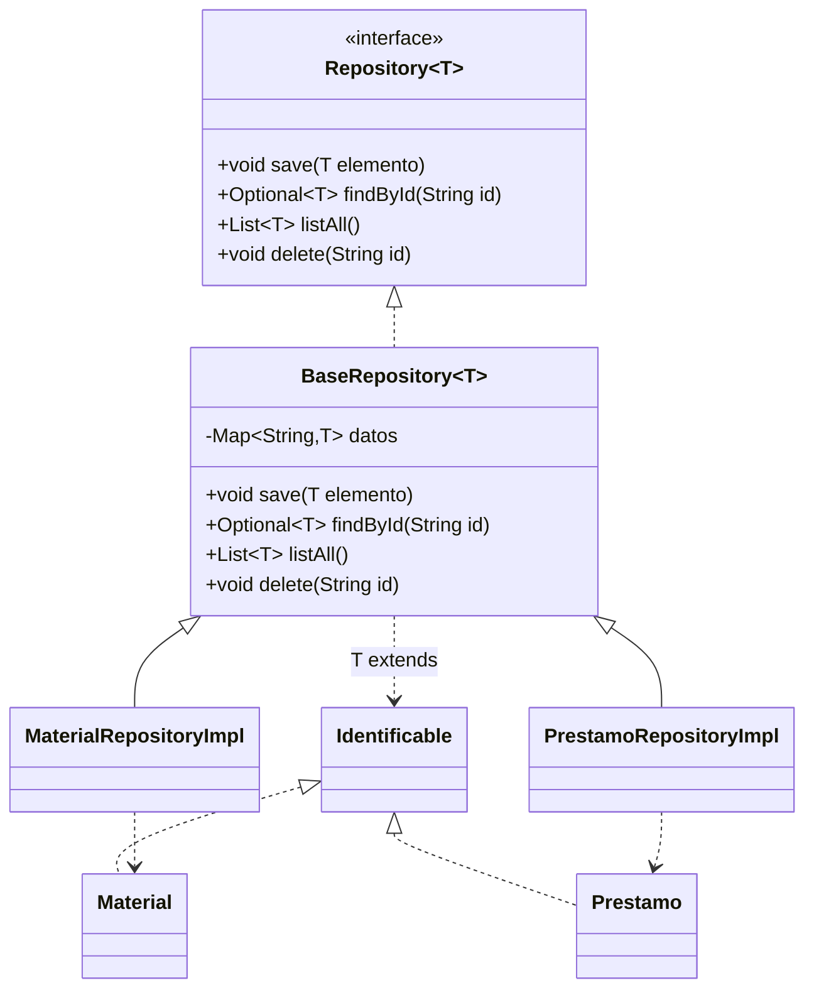
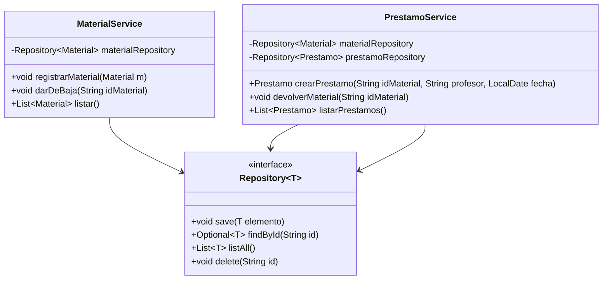

# Diagrama de clases (Mermaid)

Este diagrama sirve como referencia para implementar el modelo, repositorios y servicios del examen.
**Debes crear tú las clases/interfaces/enums** en los paquetes indicados.

Paquetes recomendados (según enunciado):
- `es.fplumara.dam1.prestamos.model`
- `es.fplumara.dam1.prestamos.repository`
- `es.fplumara.dam1.prestamos.service`

> Nota: el bloque CSV está proporcionado y no se modifica. Por eso no aparece aquí.

---

## Modelo (POO)

---

## Repositorios

## Servicios (reglas de negocio)

> El diagrama muestra los servicios dependiendo de repositorios.

